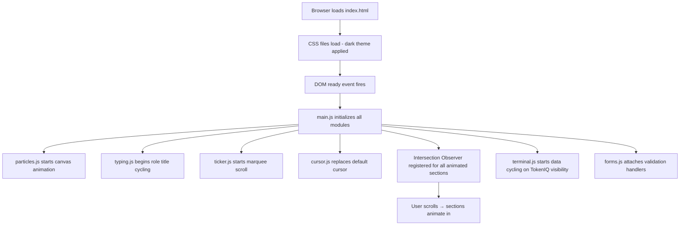
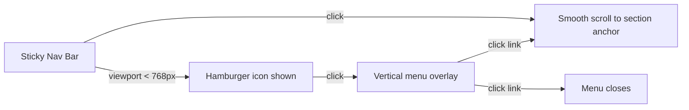

# Design Document: Portfolio Website v2

## Overview

A single-page static portfolio website for Vishal Shorghar — a Senior Cloud Solutions Architect, AWS SA, and GenAI builder based in Copenhagen. The site is built with vanilla HTML, CSS, and JavaScript (no frameworks, no build tools) and deploys directly to S3 + CloudFront.

The visual identity is a futuristic dark theme featuring canvas-based particle animations, glassmorphism cards, neon accent colors (cyan, purple, emerald), a custom cursor, and scroll-triggered animations via Intersection Observer. The site is fully responsive across desktop (1200px+), tablet (768–1199px), and mobile (<768px).

Key interactive elements include a typing animation for role titles, a continuously scrolling ticker banner, a terminal mockup cycling simulated financial data for the TokenIQ project, client-side validated forms (booking + contact) with simulated success responses, and a hamburger menu for mobile navigation.

## Architecture

### High-Level Structure

The website is a single `index.html` file supported by modular CSS and JS files. No bundler, transpiler, or framework is used.

```
portfolio-website-v2/
├── index.html                  # Single-page HTML document
├── assets/
│   ├── css/
│   │   ├── main.css            # Base styles, variables, reset, typography
│   │   ├── components.css      # Glassmorphism cards, pills, badges, buttons
│   │   ├── sections.css        # Section-specific layouts and styles
│   │   ├── animations.css      # Keyframes, transitions, scroll animations
│   │   └── responsive.css      # Media queries for tablet and mobile
│   ├── js/
│   │   ├── main.js             # App init, smooth scroll, nav, intersection observer
│   │   ├── particles.js        # Canvas-based particle background animation
│   │   ├── typing.js           # Typing animation for hero role titles
│   │   ├── terminal.js         # Terminal mockup cycling for TokenIQ
│   │   ├── ticker.js           # Ticker banner continuous scroll
│   │   ├── cursor.js           # Custom cursor replacement
│   │   └── forms.js            # Form validation and simulated submission
│   └── images/
│       ├── profile-photo.jpg   # Placeholder for owner's photo
│       ├── speaking-1.jpg      # Placeholder speaking event images
│       ├── speaking-2.jpg
│       └── speaking-3.jpg
└── README.md                   # Deployment instructions
```

### Rendering Flow



### Navigation Flow




## Components and Interfaces

### 1. Navigation Bar (`main.js`)

- Sticky `<nav>` element fixed to viewport top with `position: sticky` or `position: fixed`
- Contains anchor links to each section (`#home`, `#about`, `#expertise`, `#experience`, `#projects`, `#services`, `#speaking`, `#booking`, `#contact`)
- Smooth scroll behavior via `scrollIntoView({ behavior: 'smooth' })` or CSS `scroll-behavior: smooth`
- Mobile: hamburger icon toggles a vertical overlay menu
- Active link highlighting based on scroll position using Intersection Observer

**Interface:**
```js
// main.js exports
function initNavigation()        // Sets up click handlers, hamburger toggle
function updateActiveLink()      // Highlights current section link
function toggleMobileMenu()      // Opens/closes hamburger menu
```

### 2. Particle Background (`particles.js`)

- Full-viewport `<canvas>` element positioned behind the Hero Section with `position: absolute; z-index: 0`
- Renders animated particles (small dots) that drift and connect with lines when close
- Uses `requestAnimationFrame` for smooth 60fps animation
- Particle count scales with viewport width (fewer on mobile)

**Interface:**
```js
function initParticles(canvasElement)  // Creates particle system, starts animation loop
function resizeCanvas()                // Handles viewport resize
```

### 3. Typing Animation (`typing.js`)

- Targets a `<span>` element inside the hero heading
- Cycles through role titles: "Senior Cloud Solutions Architect", "GenAI Builder", "Kubernetes Practitioner", "Cloud-Native Enthusiast", "Nordic Tech Speaker"
- Types characters one by one, pauses, then deletes and moves to next title
- Loops infinitely

**Interface:**
```js
function initTypingAnimation(element, titles, speed)  // Starts the typing cycle
```

### 4. Terminal Mockup (`terminal.js`)

- A styled `<div>` with monospace font, dark background, green/cyan text simulating a terminal
- Displays fake financial data lines (token symbols, prices, changes)
- Every 3 seconds, a new line is appended and the oldest line fades out
- Only active when the TokenIQ card is visible (controlled by Intersection Observer)

**Interface:**
```js
function initTerminal(containerElement)  // Sets up terminal, starts data cycling
function generateFakeEntry()             // Returns a random financial data string
function startCycling()                  // Begins 3-second interval
function stopCycling()                   // Pauses when not visible
```

### 5. Ticker Banner (`ticker.js`)

- A horizontally scrolling `<div>` containing keyword spans
- Uses CSS `@keyframes` animation with `translateX` for continuous scroll
- Keywords duplicated in DOM to create seamless infinite loop effect

**Interface:**
```js
function initTicker(containerElement)  // Duplicates content, starts CSS animation
```

### 6. Custom Cursor (`cursor.js`)

- A small `<div>` element styled as a glowing dot/crosshair
- Follows mouse position via `mousemove` event listener
- Default cursor hidden via `cursor: none` on `body`
- Disabled on touch devices (detected via `matchMedia('(pointer: coarse)')`)

**Interface:**
```js
function initCustomCursor()  // Creates cursor element, attaches mousemove listener
```

### 7. Forms Handler (`forms.js`)

- Handles both the Booking Form and Contact Form
- Client-side validation: checks all required fields are non-empty, validates email format
- On valid submission: shows a simulated success message (green confirmation banner)
- On invalid submission: highlights missing fields with error messages
- No actual backend call — placeholder for future Formspree/API Gateway integration

**Interface:**
```js
function initForms()                          // Attaches submit handlers to both forms
function validateForm(formElement)             // Returns { valid: boolean, errors: string[] }
function showSuccess(formElement)              // Displays success confirmation
function showErrors(formElement, errors)       // Displays field-level error messages
function validateEmail(email)                  // Returns boolean for email format check
```

### 8. Scroll Animations (`main.js`)

- Uses Intersection Observer API to detect when sections/cards enter the viewport
- Adds CSS classes (e.g., `.visible`, `.animate-in`) to trigger CSS transitions
- Staggered animation for timeline entries and card grids
- Threshold: ~10-20% visibility triggers animation

### 9. Glassmorphism Card Component (CSS)

- Reusable `.glass-card` CSS class
- Properties: `backdrop-filter: blur(10px)`, `background: rgba(255,255,255,0.05)`, `border: 1px solid rgba(255,255,255,0.1)`, `border-radius: 16px`
- Hover state: subtle scale transform + enhanced glow

### 10. Status Badge Component (CSS + HTML)

- Small inline element with pulsing dot animation
- Amber variant for "PoC", blue variant for "In Development"
- CSS `@keyframes pulse` for the dot animation

### 11. Tech Stack Pills (CSS)

- Inline `<span>` elements with neon glow border
- Styled with `border: 1px solid` + `box-shadow` using neon accent colors
- Slight hover glow intensification

### 12. Timeline Progress Indicator (CSS + HTML)

- Horizontal bar with 4 stages: Idea → PoC → Building → Live
- Current stage highlighted with neon accent, past stages filled, future stages dimmed
- Pure CSS implementation with flexbox


## Data Models

Since this is a static front-end application with no database, "data models" here refers to the structured content and configuration objects used by JavaScript modules.

### Typing Animation Data

```js
const ROLE_TITLES = [
  "Senior Cloud Solutions Architect",
  "GenAI Builder",
  "Kubernetes Practitioner",
  "Cloud-Native Enthusiast",
  "Nordic Tech Speaker"
];
```

### Stats Row Data

```js
const STATS = [
  { value: "$10M+", label: "Revenue Influenced" },
  { value: "18+", label: "Years Experience" },
  { value: "4x", label: "AWS Certified" },
  { value: "40M+", label: "Users Served" },
  { value: "15+", label: "Workshops Delivered" }
];
```

### Ticker Keywords

```js
const TICKER_KEYWORDS = [
  "AWS", "Kubernetes", "GenAI", "Linux", "OpenShift",
  "Cloud Architecture", "FinOps", "RDMA", "InfiniBand", "Nordic Customers"
];
```

### Terminal Mockup Data (TokenIQ)

```js
// Fake financial data entries cycled every 3 seconds
const TOKEN_SYMBOLS = ["BTC", "ETH", "SOL", "AVAX", "MATIC", "DOT", "LINK"];
// generateFakeEntry() produces lines like:
// "[14:32:07] BTC/USD  $67,234.50  +2.3%  ▲  Vol: 1.2B"
```

### Experience Timeline Data

```js
const EXPERIENCE = [
  { title: "Solutions Architect", company: "AWS", period: "Current", description: "..." },
  { title: "Technical Account Manager", company: "AWS", period: "...", description: "..." },
  { title: "Senior Engineer", company: "Nets A/S", period: "...", metrics: "5M+ citizens, 99.99% uptime", description: "MitID/NemLogin platform" },
  { title: "Engineer", company: "Pure Storage", period: "...", description: "..." },
  { title: "Engineer", company: "Radisys/JIO", period: "...", metrics: "40M+ subscribers", description: "..." },
  { title: "Engineer", company: "Cisco", period: "...", description: "..." },
  { title: "Engineer", company: "Chelsio Communications", period: "...", description: "..." },
  { title: "Trainer", company: "IIHT", period: "2007", description: "..." }
];
```

### Certifications Data

```js
const CERTIFICATIONS = [
  { name: "AWS Certified GenAI Developer - Professional", year: "2025", newest: true },
  { name: "AWS Certified GenAI Practitioner", year: "Early Adopter", badge: "aws" },
  { name: "AWS Certified Solutions Architect - Professional", year: "2024", badge: "aws" },
  { name: "AWS Certified Solutions Architect - Associate", year: "2023", badge: "aws" },
  { name: "Certified Kubernetes Administrator (CKA)", year: "", badge: "k8s" },
  { name: "Azure Solutions Architect (AZ-303, AZ-304)", year: "", badge: "azure" },
  { name: "Red Hat Certified Engineer (RHCE)", year: "", badge: "redhat" }
];
```

### Project Cards Data

```js
const PROJECTS = [
  {
    name: "TokenIQ",
    status: "PoC",
    statusColor: "amber",
    featured: true,
    techStack: ["Python", "LangChain", "AWS Bedrock", "DynamoDB"],
    timelineStage: 1, // 0=Idea, 1=PoC, 2=Building, 3=Live
    hasTerminal: true
  },
  {
    name: "Portfolio Doctor",
    status: "In Development",
    statusColor: "blue",
    featured: false,
    techStack: ["Python", "GenAI", "AWS"],
    timelineStage: 2
  },
  {
    name: "More Coming Soon",
    status: null,
    featured: false,
    teaser: true
  }
];
```

### Booking Session Types

```js
const SESSION_TYPES = [
  { duration: "30 min", title: "Quick Connect", description: "Specific questions and sanity checks" },
  { duration: "60 min", title: "Architecture Deep Dive", description: "Working through architecture challenges" },
  { duration: "90 min", title: "Strategic Advisory", description: "Broader transformation strategy" }
];
```

### Form Validation Rules

```js
// Booking Form required fields
const BOOKING_REQUIRED = ["name", "email", "company", "role", "sessionType", "topic", "message", "timezone"];

// Contact Form required fields
const CONTACT_REQUIRED = ["name", "email", "subject", "message"];

// Email validation regex
const EMAIL_REGEX = /^[^\s@]+@[^\s@]+\.[^\s@]+$/;
```

### CSS Design Tokens (Custom Properties)

```css
:root {
  /* Base colors */
  --bg-primary: #0a0a0f;
  --bg-secondary: #12121a;
  --text-primary: #e0e0e0;
  --text-secondary: #a0a0b0;

  /* Neon accents */
  --neon-cyan: #00f0ff;
  --neon-purple: #b44aff;
  --neon-emerald: #00ff88;

  /* Glassmorphism */
  --glass-bg: rgba(255, 255, 255, 0.05);
  --glass-border: rgba(255, 255, 255, 0.1);
  --glass-blur: 10px;

  /* Spacing */
  --section-padding: 100px 0;
  --card-padding: 24px;
  --card-radius: 16px;

  /* Typography */
  --font-primary: 'Inter', system-ui, sans-serif;
  --font-mono: 'Fira Code', 'Courier New', monospace;
}
```


## Correctness Properties

*A property is a characteristic or behavior that should hold true across all valid executions of a system — essentially, a formal statement about what the system should do. Properties serve as the bridge between human-readable specifications and machine-verifiable correctness guarantees.*

### Property 1: Typing animation visits all titles

*For any* array of role titles provided to the typing animation module, after one complete cycle, every title in the array should have been displayed exactly once in order.

**Validates: Requirements 2.2**

### Property 2: Ticker content duplication for seamless loop

*For any* set of ticker keywords, after initialization the ticker container DOM should contain at least two copies of each keyword to enable seamless infinite CSS scroll animation.

**Validates: Requirements 2.4**

### Property 3: Experience entry rendering completeness

*For any* experience entry object containing title, company, period, and description fields, the rendered HTML output should contain all four values. If the entry also includes a metrics field, that value should also appear in the output.

**Validates: Requirements 5.3**

### Property 4: Terminal data generator format validity

*For any* call to `generateFakeEntry()`, the returned string should contain a valid token symbol from the known set, a dollar-formatted price, and a percentage change value with a directional indicator.

**Validates: Requirements 6.4**

### Property 5: Timeline progress indicator stage highlighting

*For any* project with a `timelineStage` value between 0 and 3, the rendered timeline progress indicator should mark all stages up to and including the current stage as completed/active, and all stages after as inactive.

**Validates: Requirements 6.10**

### Property 6: Service card rendering completeness

*For any* service card data object containing title, description, and icon fields, the rendered HTML output should contain all three values.

**Validates: Requirements 7.2**

### Property 7: Newest certification highlight uniqueness

*For any* list of certification objects where exactly one is marked as `newest: true`, the rendered output should apply the highlight/glow CSS class to exactly that one certification and no others.

**Validates: Requirements 8.2**

### Property 8: Speaking entry rendering completeness

*For any* speaking entry data object containing eventName, topic, and imagePath fields, the rendered HTML output should contain all three values.

**Validates: Requirements 9.2**

### Property 9: Form validation accepts complete valid submissions

*For any* form configuration (booking or contact) and any form data object where all required fields are non-empty strings and the email field matches a valid email format, `validateForm()` should return `{ valid: true, errors: [] }`.

**Validates: Requirements 10.3, 11.2**

### Property 10: Form validation rejects incomplete submissions with specific errors

*For any* form configuration (booking or contact) and any form data object where at least one required field is an empty string, `validateForm()` should return `{ valid: false }` with the errors array containing the names of all missing required fields.

**Validates: Requirements 10.4, 11.3**

### Property 11: Particle system scales with canvas dimensions

*For any* positive canvas width and height, `initParticles()` should create a non-zero number of particles, and the particle count should scale proportionally with the canvas area (larger canvas = more particles).

**Validates: Requirements 12.2**


## Error Handling

### Form Validation Errors

- Missing required fields: highlight the field with a red border and display an inline error message below it (e.g., "Name is required")
- Invalid email format: display "Please enter a valid email address" below the email field
- On successful simulated submission: show a green confirmation banner ("Message sent successfully! We'll get back to you soon.") and reset the form
- All error/success messages are client-side only — no network errors to handle in v1

### Image Loading Errors

- Profile photo and speaking images use placeholder paths (`assets/images/profile-photo.jpg`, `assets/images/speaking-*.jpg`)
- If images fail to load, the `` elements should have `alt` text describing the content and a CSS fallback background (gradient or icon)
- No broken image icons should be visible

### JavaScript Module Errors

- Each JS module (`particles.js`, `typing.js`, `terminal.js`, `ticker.js`, `cursor.js`, `forms.js`) initializes independently
- If one module fails (e.g., canvas not supported), it should not prevent other modules from initializing
- `main.js` wraps each module init in a try/catch and logs errors to console
- Custom cursor gracefully degrades: if `matchMedia('(pointer: coarse)')` matches (touch device), skip cursor replacement entirely

### Browser Compatibility

- Canvas API required for particle background — if unavailable, the hero section renders without particles (CSS gradient fallback)
- Intersection Observer required for scroll animations — if unavailable, all sections render in their final visible state (no animation, content still accessible)
- `backdrop-filter` for glassmorphism may not be supported in older browsers — fallback to solid semi-transparent background

## Testing Strategy

### Unit Tests (Example-Based)

Unit tests verify specific content, structure, and edge cases. Use a lightweight test runner compatible with vanilla JS (e.g., Vitest with jsdom, or plain Node.js test runner with jsdom).

Focus areas:
- Navigation link order matches requirement (Req 1.1)
- Stats row contains all 5 metrics (Req 2.3)
- Certifications listed in correct order (Req 8.1)
- Meta tags contain correct title, description, keywords, OG tags (Req 13.1–13.4)
- Disclaimer text appears in footer, booking, and contact sections (Req 14.1–14.3)
- No external CDN/framework dependencies in HTML (Req 15.3)
- Form fields exist for both booking and contact forms (Req 10.2, 11.1)
- Session type cards display correct durations and titles (Req 10.1)
- Project section order: TokenIQ → Portfolio Doctor → teaser (Req 6.1, 6.9)
- Status badges show correct labels and colors (Req 6.7, 6.8)

### Property-Based Tests

Property-based tests use [fast-check](https://github.com/dubzzz/fast-check) to generate random inputs and verify universal properties hold across all valid inputs. Each property test runs a minimum of 100 iterations.

Each test is tagged with a comment referencing the design property:

```js
// Feature: portfolio-website-v2, Property 1: Typing animation visits all titles
// Feature: portfolio-website-v2, Property 2: Ticker content duplication for seamless loop
// Feature: portfolio-website-v2, Property 3: Experience entry rendering completeness
// Feature: portfolio-website-v2, Property 4: Terminal data generator format validity
// Feature: portfolio-website-v2, Property 5: Timeline progress indicator stage highlighting
// Feature: portfolio-website-v2, Property 6: Service card rendering completeness
// Feature: portfolio-website-v2, Property 7: Newest certification highlight uniqueness
// Feature: portfolio-website-v2, Property 8: Speaking entry rendering completeness
// Feature: portfolio-website-v2, Property 9: Form validation accepts complete valid submissions
// Feature: portfolio-website-v2, Property 10: Form validation rejects incomplete submissions with specific errors
// Feature: portfolio-website-v2, Property 11: Particle system scales with canvas dimensions
```

**Property test implementation notes:**
- Properties 3, 4, 6, 8: Generate random data objects with `fc.record()` and verify rendered output contains all fields
- Properties 9, 10: Generate random form data with `fc.record()` using `fc.string()` for fields, selectively empty some fields for Property 10
- Property 5: Generate random `timelineStage` values (0–3) and verify correct stage highlighting
- Property 7: Generate random-length certification arrays with exactly one `newest: true` entry
- Property 11: Generate random positive integers for canvas width/height and verify particle count > 0

**Test configuration:**
- Test runner: Vitest with jsdom environment
- Property testing library: fast-check
- Minimum iterations per property test: 100
- Each property test must reference its design document property number in a comment tag
- Each correctness property is implemented by a single property-based test

